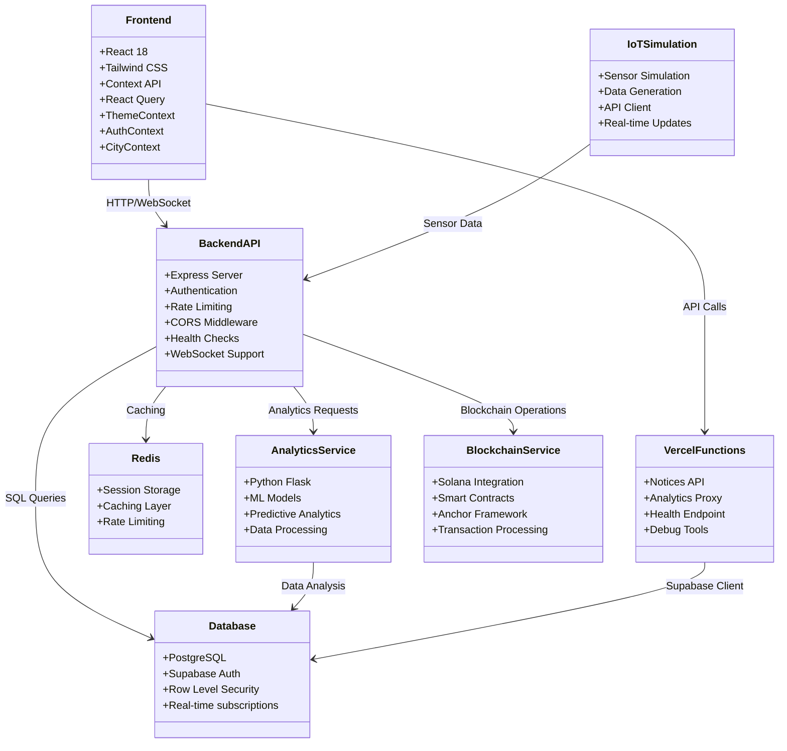
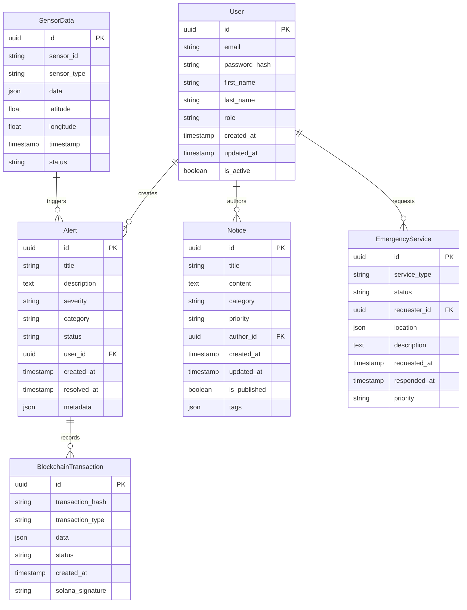
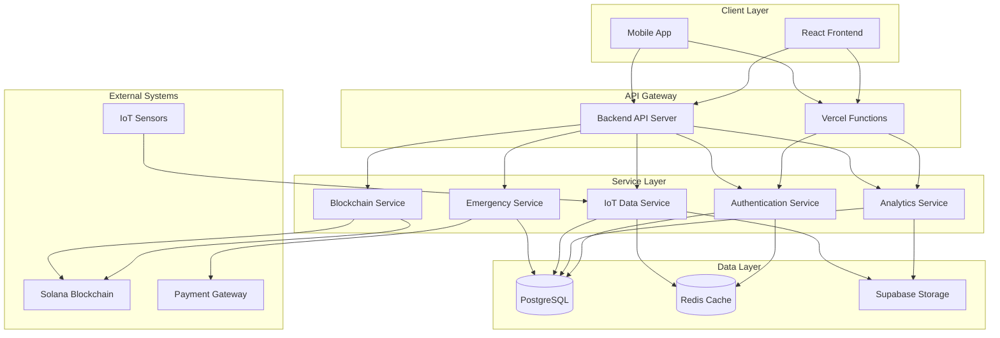
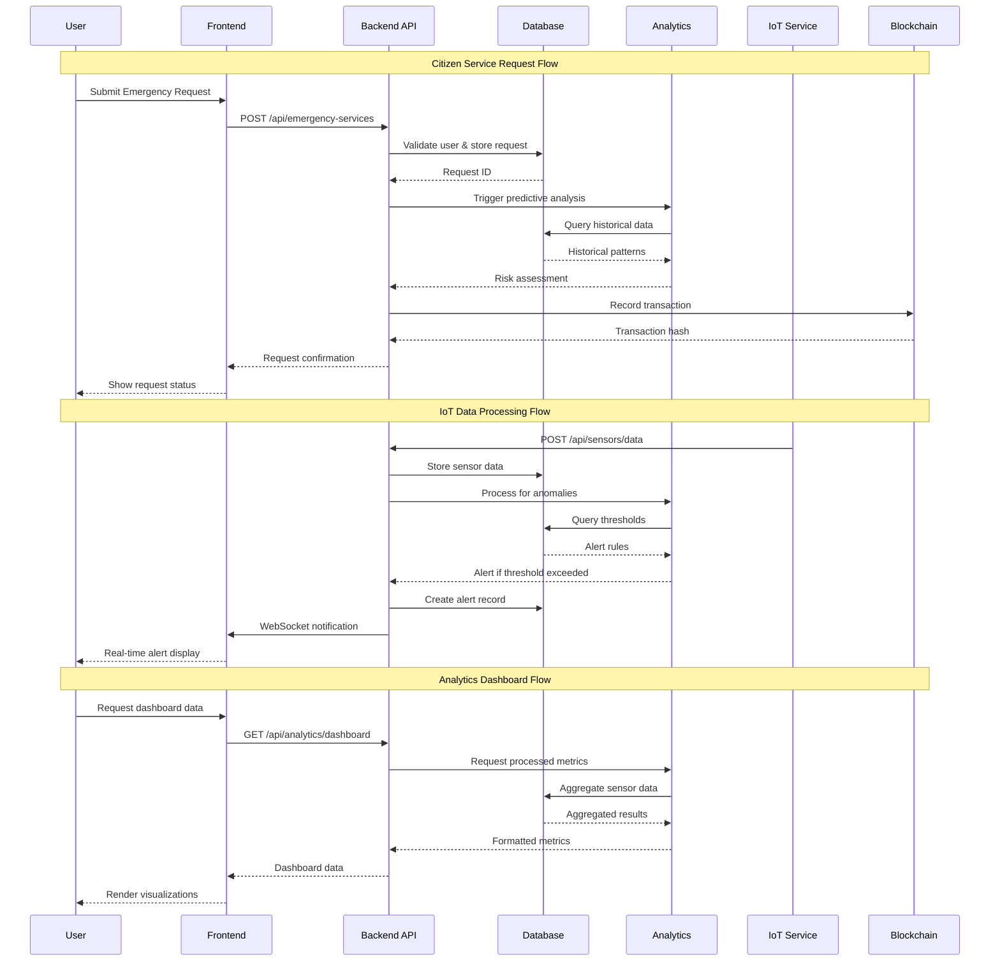
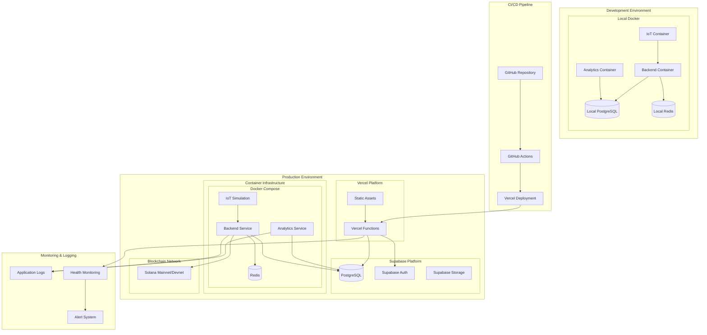
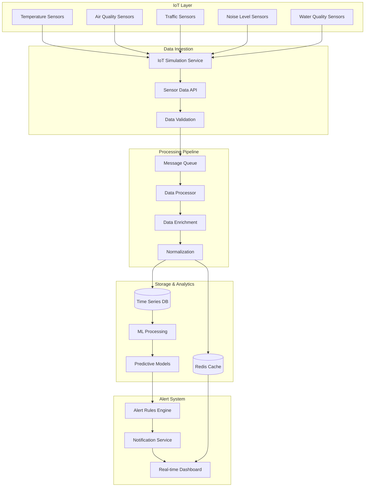

# Smart City OS Architecture

This document provides a comprehensive architectural overview of the Smart City Operating System, including system components, data flows, and deployment strategies.

## System Overview

Smart City OS is a comprehensive platform that integrates IoT sensors, predictive analytics, blockchain transparency, and citizen services into a unified urban management system.

### Core Technologies
- **Frontend**: React 18, React Router, Tailwind CSS
- **Backend**: Node.js with Express, Vercel Functions
- **Database**: PostgreSQL (Supabase), Redis for caching
- **Analytics**: Python-based analytics service
- **Blockchain**: Solana integration with Anchor framework
- **IoT**: Python-based sensor simulation and data pipeline
- **Deployment**: Docker containers, Vercel hosting

## Architecture Diagrams

### 1. System Architecture Overview

### 2. Database Entity Relationships

### 3. Component Interaction (UML)

### 4. Request Flow Sequence

### 5. Deployment Architecture

### 6. Sensor Data Flow Pipeline

## System Components

### Frontend (React Application)
- **Location**: `frontend/`
- **Technology**: React 18, React Router, Tailwind CSS
- **State Management**: Context API for Auth/Theme/City, React Query for data fetching
- **Features**: 
  - Dark/Light theme with localStorage persistence
  - Responsive design for mobile and desktop
  - Real-time updates via WebSocket
  - Interactive dashboards and visualizations

### Backend Services

#### Main API Server
- **Location**: `backend/`
- **Technology**: Node.js with Express
- **Features**:
  - RESTful API endpoints
  - WebSocket support for real-time updates
  - JWT-based authentication
  - Rate limiting and security middleware
  - Health monitoring endpoints

#### Vercel Functions
- **Location**: `api/`
- **Purpose**: Serverless endpoints for specific features
- **Endpoints**:
  - `/api/notices` - Notice management
  - `/api/health` - Health checks
  - `/api/analytics` - Analytics proxy
  - `/api/[[...slug]]` - Dynamic routing

### Data Layer

#### Primary Database (Supabase/PostgreSQL)
- **Purpose**: Main data storage with built-in auth
- **Features**:
  - Row Level Security (RLS)
  - Real-time subscriptions
  - Built-in authentication
  - RESTful API generation

#### Caching Layer (Redis)
- **Purpose**: Session storage and performance optimization
- **Use Cases**:
  - User session management
  - API response caching
  - Rate limiting counters
  - Real-time data buffering

### Analytics Service
- **Location**: `analytics/`
- **Technology**: Python with Flask
- **Capabilities**:
  - Machine learning model inference
  - Predictive analytics for city planning
  - Anomaly detection in sensor data
  - Statistical analysis and reporting

### IoT Integration
- **Location**: `iot-simulation/`
- **Purpose**: Simulate and manage IoT sensor data
- **Features**:
  - Multi-sensor type simulation
  - Configurable data generation patterns
  - Real-time data streaming
  - Geographic distribution simulation

### Blockchain Integration
- **Location**: `blockchain/` and `anchor_project/`
- **Technology**: Solana blockchain with Anchor framework
- **Use Cases**:
  - Transparent governance voting
  - Immutable audit trails
  - Smart contract automation
  - Decentralized identity management

## Key Data Flows

### 1. Citizen Service Request
1. User submits request via frontend
2. Frontend validates and sends to API
3. API authenticates user and stores request
4. Analytics service assesses priority and resource allocation
5. Blockchain records transaction for transparency
6. Real-time updates sent to relevant stakeholders

### 2. IoT Data Processing
1. Sensors generate data (simulated or real)
2. IoT service validates and normalizes data
3. Data stored in time-series optimized format
4. Analytics service processes for anomalies
5. Alerts generated based on predefined rules
6. Dashboard updated with real-time visualizations

### 3. Emergency Response
1. Emergency detected (manual report or sensor trigger)
2. System prioritizes based on severity and location
3. Appropriate services automatically notified
4. Resource allocation optimized using predictive models
5. Response tracked and recorded on blockchain
6. Citizens updated via multiple channels

## Deployment Strategies

### Production Deployment
- **Frontend**: Vercel static hosting with CDN
- **API Functions**: Vercel serverless functions
- **Database**: Supabase managed PostgreSQL
- **Analytics**: Containerized Python service
- **Monitoring**: Integrated logging and health checks

### Development Environment
- **Local Setup**: Docker Compose for full stack
- **Database**: Local PostgreSQL container
- **Services**: Hot-reload enabled containers
- **Testing**: Automated test suites for all components

### Scaling Considerations
- **Horizontal Scaling**: Containerized services can be replicated
- **Database Scaling**: Read replicas and connection pooling
- **Caching Strategy**: Multi-layer caching with Redis
- **CDN Integration**: Static asset optimization
- **Load Balancing**: Service mesh for microservices communication

## Security Architecture

### Authentication & Authorization
- JWT-based authentication with refresh tokens
- Role-based access control (RBAC)
- API key management for service-to-service communication
- OAuth integration for third-party services

### Data Protection
- Encryption at rest and in transit
- Row-level security in database
- Input validation and sanitization
- Rate limiting and DDoS protection

### Blockchain Security
- Multi-signature wallet integration
- Smart contract auditing
- Secure key management
- Transaction verification protocols

## Monitoring & Observability

### Application Monitoring
- Health check endpoints for all services
- Performance metrics collection
- Error tracking and alerting
- User activity analytics

### Infrastructure Monitoring
- Container resource utilization
- Database performance metrics
- Network latency monitoring
- Storage capacity tracking

### Business Intelligence
- Citizen engagement metrics
- Service efficiency analytics
- Resource utilization reports
- Predictive maintenance insights

