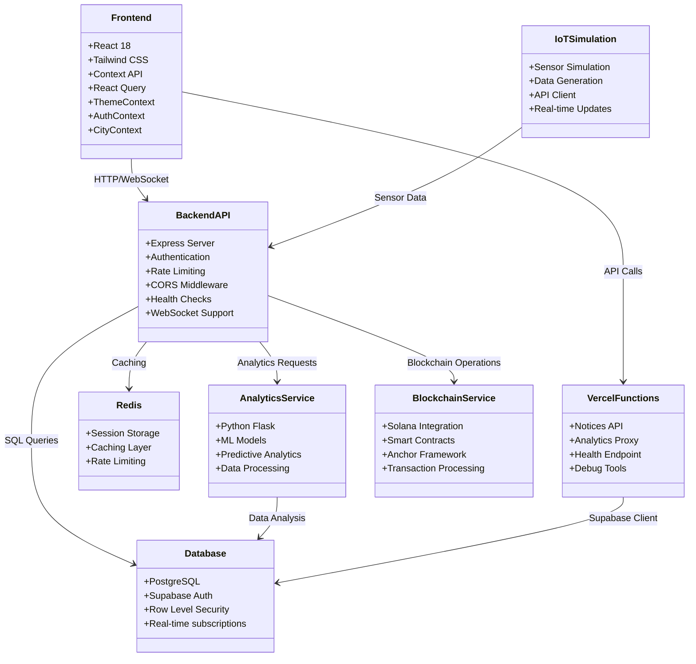

# Smart City OS - Complete Urban Management Platform

A comprehensive, production-ready smart city management platform featuring AI-powered analytics, blockchain transparency, and real-time IoT monitoring.


Built as a capstone project, was meant to be a simple Full Stack Smart City Management Platform, but tried introducing multiple mucroservice modules inspired from the web.

Waste and different IoT Sensors : https://www.youtube.com/watch?v=v8HIJYyBeSg

Integrated Smart CIty Management Program ( Civil Engineering ) : https://www.youtube.com/playlist?list=PL3MO67NH2XxIYo-UFN8csPPnEiYVyR0TO

Loved the Meri Panchayat Application by Ministry of Panchayat Raj ( similar can be integrated in a smart city dashboard for citizens to access and view their area services ) : https://play.google.com/store/apps/details?id=com.meri_panchayat


National Blockchain Stack ( Blockchain_As_A_Service Stack ): https://blockchain.meity.gov.in/index.php/articles/184-vishvasya-national-blockchain-technology-stack 

more...

credit where it's due 


### Full System Architecture Overview




## 🌟 Features

### Core Platform

### Advanced Features
- **Predictive Analytics** - LSTM/ARIMA models for traffic, energy, and environmental forecasting
- **Blockchain Integration** - Solana-based transparent logging for data integrity
- **Professional UI/UX** - Modern design system with Lucide React icons
- **Error Handling** - Comprehensive error boundaries and fallback mechanisms
- **Performance Optimization** - React Query caching and optimized rendering

## 🏗️ Architecture

### Frontend (React 18)
- **Framework**: React 18 with functional components and hooks
- **Routing**: React Router v6 with protected routes
- **State Management**: React Query + Context API
- **Styling**: Custom CSS design system with CSS variables
- **Icons**: Lucide React professional icon library
- **Animations**: Framer Motion for smooth transitions
- **Charts**: Recharts for data visualization

### Backend (Node.js)
- **Framework**: Express.js with comprehensive middleware
- **Database**: PostgreSQL with Sequelize ORM (fallback to in-memory)
- **Real-time**: Socket.IO for WebSocket connections
- **Authentication**: JWT with Stack Auth integration
- **API**: RESTful design with comprehensive error handling

### Analytics Service (Python)
- **Framework**: Flask with CORS support
- **ML Models**: Scikit-learn for LSTM/ARIMA predictions
- **Data Processing**: NumPy and Pandas for time series analysis
- **Deployment**: Gunicorn-ready for production

### Blockchain Service (Solana)
- **Network**: Solana Devnet integration
- **Smart Contracts**: Transparent data logging and verification
- **Features**: Transaction queuing, integrity verification, audit trails

## 🚀 Quick Start (Frontend + Serverless API)

This repository contains a React frontend in `frontend/` and serverless API routes in `api/` for notices. The simplest way to run locally is:

### Prerequisites
- Node.js 18+
- Vercel CLI (for local API): `npm i -g vercel` (optional but recommended)
- Supabase project (for notices data)

### 1) Frontend
```bash
git clone https://github.com/p4r1ch4y/smart_city_os/
cd smart-city_os/frontend
cp .env.example .env.local   # fill in your Supabase URL and anon key
npm install
npm start
```
By default the UI runs at http://localhost:3000.

### 2) API (optional, for creating notices locally)
Option A  use your deployed API base:
- Set `REACT_APP_API_URL` in `frontend/.env.local` to your API base, e.g. `https://your-deployment.vercel.app/api`

Option B  run serverless API locally with Vercel:
```bash
# In a separate terminal at the repo root
cd smart_city_os
vercel dev
```
Then set `REACT_APP_API_URL=http://localhost:3000/api` in `frontend/.env.local` and restart the frontend dev server.

Notes
- Dark mode is enabled by default; toggle is stored in localStorage.
- If you dont set `REACT_APP_API_URL`, the app will call relative `/api` which only works when the frontend and API are deployed together.

More details: see CONTRIBUTING.md and ARCHITECTURE.md.


### 3) Backend Local (optional)
If you prefer running the legacy Node backend locally, you can start it in no‑DB fallback mode.

```bash
# From the repo root
cp backend/.env.example .env   # creates a root .env used by the backend
node backend/server.js         # starts on http://localhost:3030
```

Notes
- In development, the frontend (CRA) dev server proxies to http://localhost:3030 (see frontend/package.json `proxy`).
- To run with a real Postgres instead of fallback, edit `.env` with your DB settings (or set `DATABASE_URL`) and set `FALLBACK_NO_DB=false`.
- If you see DB connect errors, ensure your DB is reachable or keep `FALLBACK_NO_DB=true`.


## ⚡️ Economic Model Update

**Sensor Data Aggregation:**
To ensure economic viability, individual sensor readings are now aggregated off-chain at regular intervals (e.g., hourly/daily). Only compiled summaries and essential contract metadata are pushed to the blockchain, dramatically reducing transaction costs and network congestion.

**Blockchain Usage:**
Solana is used for transparent logging of contract state and periodic, aggregated sensor summaries. Raw sensor data is stored and analyzed off-chain for analytics and dashboard visualization.


## Project Structure

```
smart-city-os/
├── backend/                 # Express.js API server
├── frontend/               # React dashboard
├── iot-simulation/         # Python IoT data simulation
├── analytics/              # Predictive analytics service
├── blockchain/             # Solana smart contracts
├── docker/                 # Docker configurations
├── k8s/                    # Kubernetes manifests
└── docs/                   # Documentation
```

## Technologies Used

- **Backend**: Node.js, Express.js, PostgreSQL, Socket.IO
- **Frontend**: React, Leaflet, Chart.js, WebSockets
- **IoT Simulation**: Python, REST APIs
- **Analytics**: Python, TensorFlow/PyTorch, LSTM, ARIMA
- **Blockchain**: Solana, Web3.js
- **DevOps**: Docker, Kubernetes, GitHub Actions

## License

MIT License
